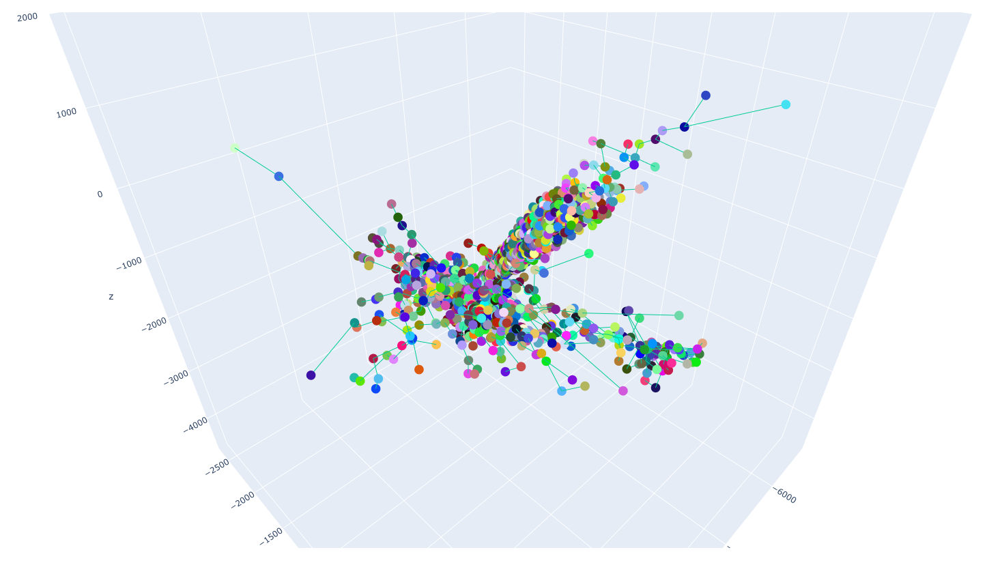
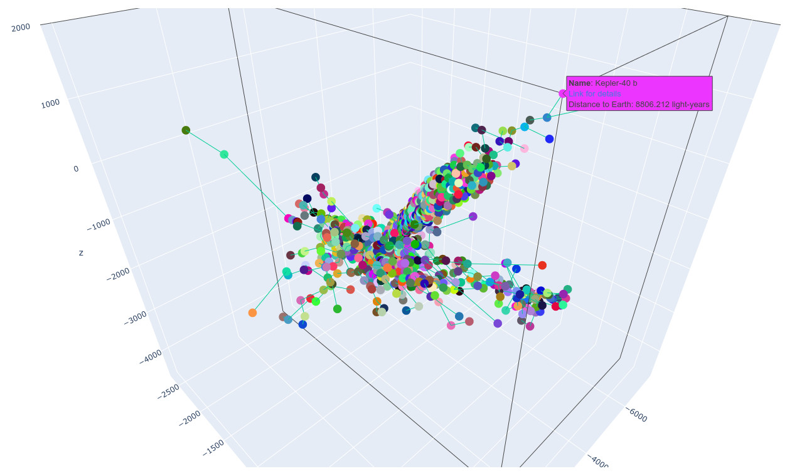
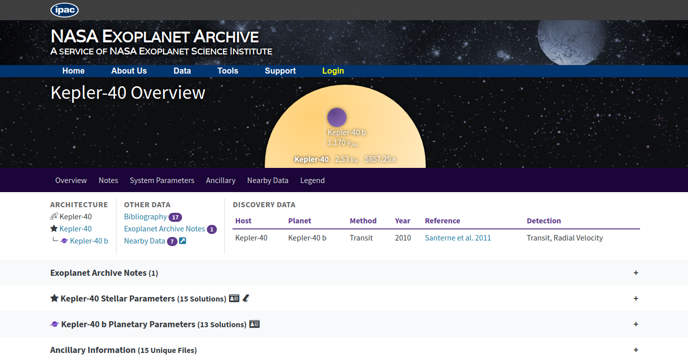
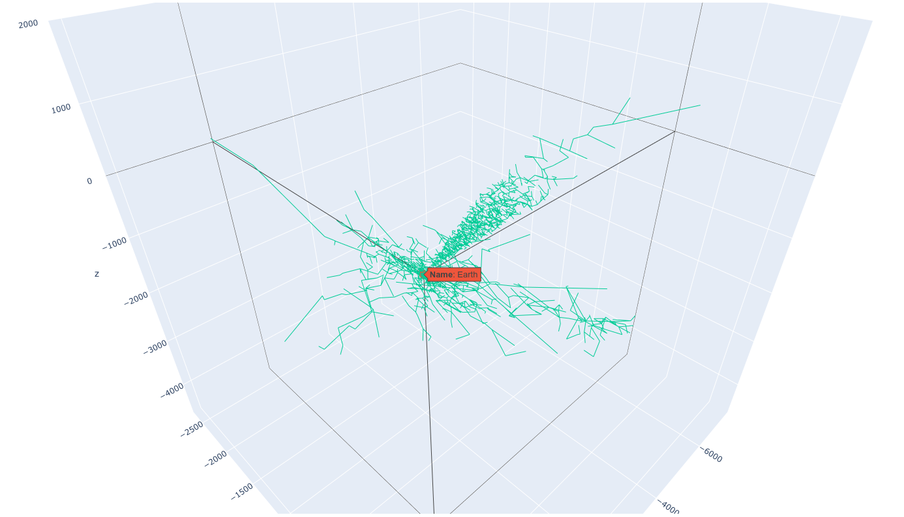
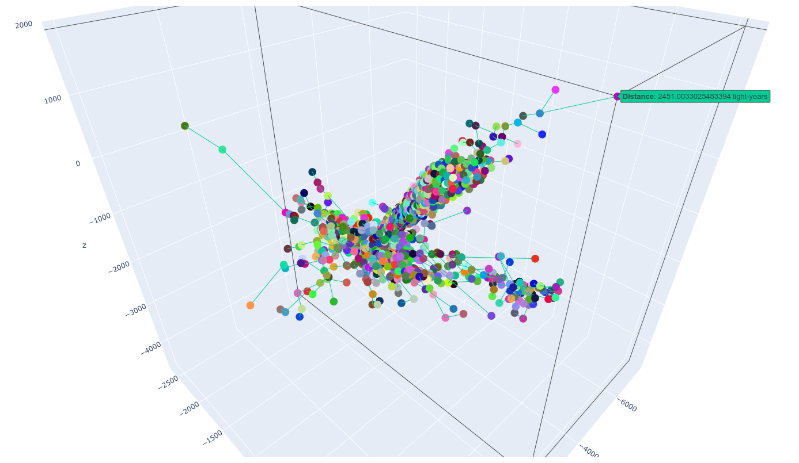
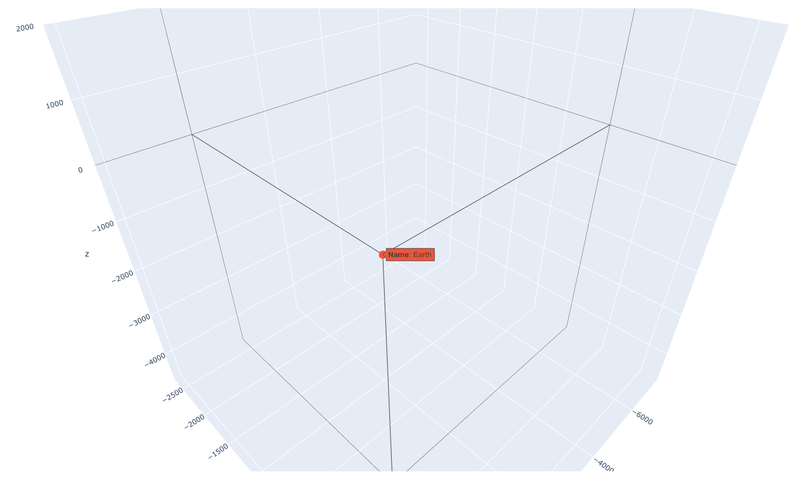

# Prim-Exoplanets

**Número da Lista**: 3<br>
**Conteúdo da Disciplina**: Greed<br>

## Alunos
|Matrícula | Aluno |
| -- | -- |
| 17/0129411  |  Guilherme Mendes Pereira |
| 17/0163571 |  Murilo Loiola Dantas |

## Sobre 
O projeto busca representar tridimensionalmente a árvore geradora mínima de todos os exoplanetas decobertos até o momento (com algumas exceções), tendo a Terra como raíz. A árvore geradora mínima foi calculada utilizando o Algoritmo de Prim. Na representação, as distâncias e posições de cada planeta (pontos) são proporcionais aos valores reais.

## Screenshots
* Plotagem dos 4.283 exoplanetas/vérticies + arestas:


* Detalhes do Exoplaneta Kepler-40 b + [Link para informações sobre o Exoplaneta](https://exoplanetarchive.ipac.caltech.edu/overview/Kepler-40%20b) (Screenshot abaixo) + Distância da Terra em [Anos-Luz](https://spaceplace.nasa.gov/light-year/en/):



* Planeta Terra + Arestas da árvore geradora mínima.


* Visualização de uma Aresta contendo a distância calculada em [Anos-Luz](https://spaceplace.nasa.gov/light-year/en/) entre 2 Exoplanetas.


* Planeta Terra (Raíz da árvore geradora mínima)



## Instalação 
**Linguagem**: Python<br>
**Pré-requisitos**: [Python](https://www.python.org/downloads/) e [pip](https://packaging.python.org/tutorials/installing-packages/).<br>
**Execução do projeto** <br>

* Clone o repositório:
```bash
git clone https://github.com/projeto-de-algoritmos/Greed_Prim-Exoplanets.git
```
* Acesse o repositório e instale as bibliotecas necessárias:
```bash
cd Greed_Prim-Exoplanets/
pip3 install -r requirements.txt
```
* Execute visualizaton.py e aguarde a plotagem do Prim-Exoplanets:
```bash
python3 src/visualizaton.py
```
* Após a execução será possível a visualização do gráfico gerado no browser.

## Uso 

### Vídeo explicativo
[Video](https://github.com/projeto-de-algoritmos/Greed_Prim-Exoplanets/blob/master/video_explicativo.mp4)

* Segure o botão esquerdo do mouse para rotacionar o campo de visão.
* Segure o botão direito do mouse para transladar o campo de visão.
* Utilize o scroll do mouse para controlar o nível de zoom.
* Posicionar a seta sobre um planeta apresentará o nome do planeta, a distância até a Terra e um link para mais informações.
* Posicionar a seta sobre uma aresta apresentará a distância entre os dois planetas ligados pela aresta.
* No lado direito da tela há uma legenda consistindo de dois círculos e uma linha:
    * O primeiro círculo representa todos os planetas, exceto a Terra.
    * O segundo círculo representa somente a Terra.
    * A linha representa as arestas.
* Clicar em algum dos ícones irá retirar da tela os objetos referentes a ele ou apresentá-los novamente, caso já tenham sido removidos (clicar no primeiro círculo, por exemplo, removerá todos os planetas, execto a Terra, da visualização)
 
## Outros
* A plotagem pode levar até um minuto, a depender da capacidade da máquina.
* Os dados necessários para calcular a distância entre os planetas foram tirados daqui: [NASA - Confirmed Planets](https://exoplanetarchive.ipac.caltech.edu/cgi-bin/TblView/nph-tblView?app=ExoTbls&config=planets).
* Nem todos os planetas descobertos foram utilizados no projeto. 10 planetas não continham um valor de distância na planilha e, por isso, foram descartados. Outros apenas foram descobertos muito recentemente e ainda não estão catalogados.
* O grafo gerado a partir da tabela e utilizado como base para o Algoritmo de Prim possui 18.339.806 arestas, representando todas as distâncias entre todos os 4.283 vértices/planetas.